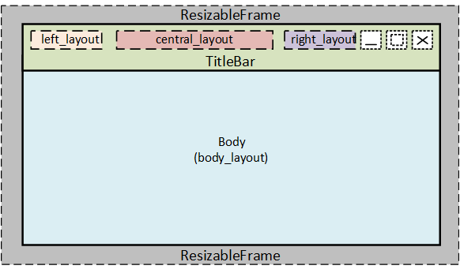

# QCustomWindow
PyQt6/PySide6 native jitterless resizable window with custom tittle bar and all Windows features

# Installation

```sh
uv add git+https://github.com/CrinitusFeles/QCustomWindow
```

or

```sh
pip install git+https://github.com/CrinitusFeles/QCustomWindow
```

You can optionally include dependencies using \[pyqt\] or \[pyside\] options e.x.:

``` sh
uv add git+https://github.com/CrinitusFeles/QCustomWindow[pyqt]
```

# Using

This library provides `CustomWindow` base class from which your widgets can be inheritance.

`CustomWindow` has three areas: `ResizableFrame` (transparent), `TitleBar` and `Body`.

<!--  -->

`CustomWindow` object has an attribute `titlebar` which you can customize as you wish. `titlebar` has 3 `QHBoxLayout` at right, center and left areas. These areas are designed for user's custom widgets.

For placing main widget user can use `body_layout` attribute which is `QVBoxLayout` object.

Also implemented fullscreen mode with `F11` hotkey similar to web browser.


Example of using `CustomWindow` you can find [here](https://github.com/CrinitusFeles/QCustomWindow/blob/main/qcustomwindow/example/custom_window_example.py).
